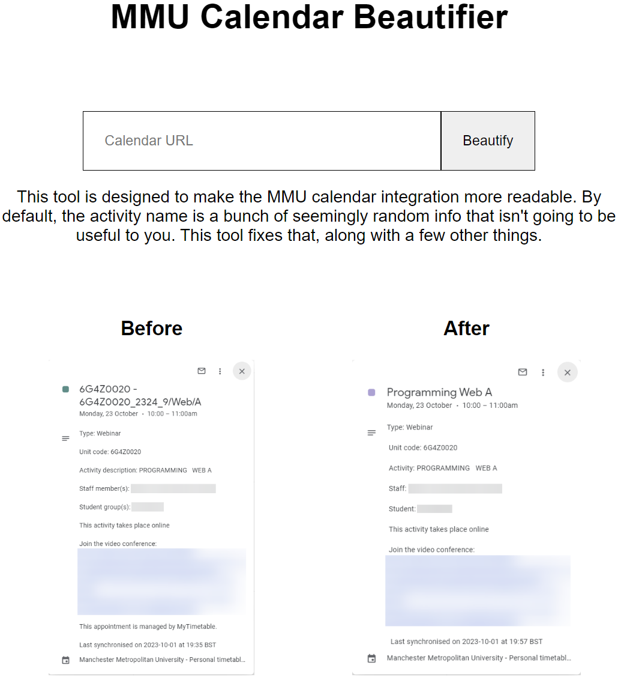

# MMUCalendarParser

This tool is designed to make the MMU calendar integration more readable. By default, the activity name is a bunch of seemingly random info that isn't going to be useful to you. This tool fixes that, along with a few other things.

